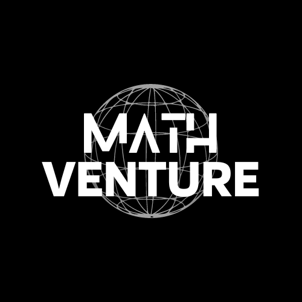

# MathVenture

MathVenture is an exciting web-based game that combines the thrill of classic space shooters with the challenge of solving math problems. Put your math skills to the test as you blast away at the correct answers in a fast-paced and action-packed gaming experience.

## Features

- Engaging space shooter gameplay
- Math questions of varying difficulty levels
- Intuitive controls for shooting and maneuvering
- High score tracking and leaderboard
- Stunning visuals and immersive sound effects
- Playable on web browsers

## How to Play

1. Use the left and right arrow keys to navigate your spaceship.
2. Aim and shoot at the correct answers to the math questions using the spacebar.
3. Earn points for each correct answer and avoid incorrect answers.
4. Progress through levels and challenge yourself to achieve a high score.

## Installation

1. Clone the repository: `git clone https://github.com/shakyapeiris/Math-Venture.git`
2. Open the game directory: `cd MathVenture`
3. Launch the game by opening `index.html` in your preferred web browser.

## Contribution

Contributions to MathVenture are welcome! If you have any ideas, bug fixes, or enhancements, feel free to open an issue or submit a pull request. Let's make MathVenture even more amazing together.

## License

MathVenture is licensed under the [MIT License](LICENSE).

---

Ready to embark on a thrilling math-solving adventure? Play MathVenture now and test your skills in an exciting gaming experience!
